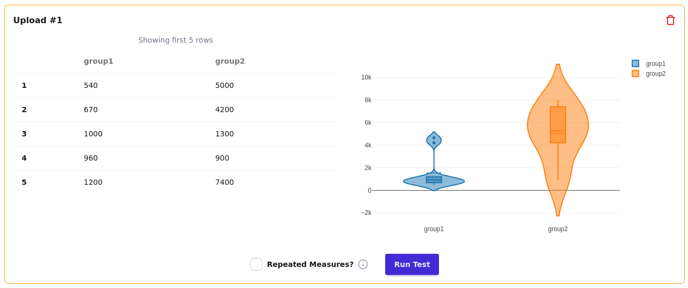
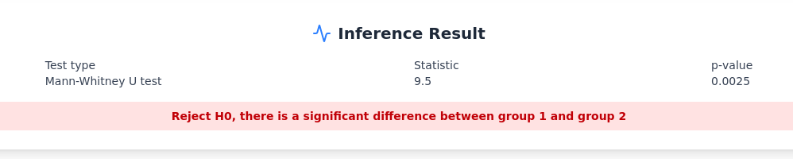
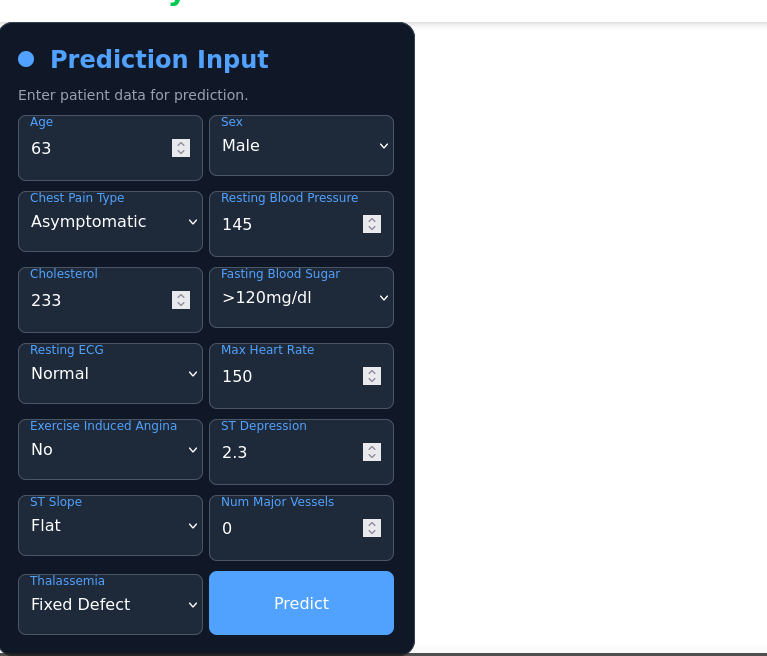
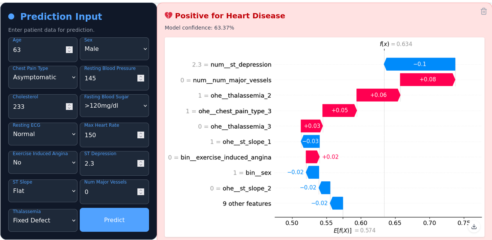

# 📊 LeafyLabs

A **fullstack web application** for automated statistical testing, heart attack prediction, and explainable Machine Learning / AI model, with secure user authentication.

---

## 🚀 Features

### ✅ User Authentication

* Register & login system with **email verification**.
* Only verified users can access the prediction features.
* **Forgot password** & **reset password** flow via email.

### ✅ Automated Statistical Tests

* Upload CSV data.
* Server automatically selects the best statistical test (e.g., t-test, ANOVA, chi-square).
* Clear result: **accept or reject null hypothesis (H₀)**.
* Visualize group differences with **interactive plots** using [Plotly.js](https://plotly.com/javascript/).

### ✅ Heart Attack Prediction

* Input relevant health indicators.
* Predict risk of heart attack using a trained ML model.
* Built with **scikit-learn** and **FastAPI**.
* Instant prediction results.

### ✅ Explainable ML Model with SHAP

* See **why** the model made a prediction.
* Visual SHAP plots showing feature contributions for each data point.

---

## 🗂️ Tech Stack

| Layer          | Tech                                       |
| -------------- | ------------------------------------------ |
| **Frontend**   | ReactJS, Plotly.js, TailwindCSS (optional) |
| **Backend**    | FastAPI (Python)                           |
| **ML & Stats** | scikit-learn, SHAP, pandas, scipy          |
| **Database**   | PostgreSQL / MongoDB (customizable)        |
| **Auth**       | JWT tokens, email verification             |
| **Deployment** | Docker            |

---

## ⚙️ Getting Started

### 1️⃣ Clone the Repository

```bash
git clone https://github.com/kinetikpod/LeafyLabs.git
cd LeafyLabs
```

---

### 2️⃣ Configure Environment Variables

Create a `.env` file in the fastapi folder:

```env
ENV=development
DATABASE_URL=postgresql://<username>:<password>@<host>:<port>/<db_name>?sslmode=require
MAILJET_SENDER_EMAIL=youremail@example.com
MAILJET_API_KEY=your_mailjet_api_key
MAILJET_SECRET_KEY=your_mailjet_secret_key
SECRET_KEY=\"your_secret_key\"
JWT_ALGORITHM=\"HS256\"
JWT_ACCESS_TOKEN_EXPIRES_MINUTES=60
EMAIL_VERIFICATION_TOKEN_TTL_MINUTES=5
CLIENT_URL=\"http://localhost:5173\"
```

---

### 3️⃣ Run with Docker Compose

```bash
docker-compose up --build
```

---

## 📁 Example Workflow

1. **Register** and verify your email.
2. **Upload your CSV data with wide range table**.
3. The app will **automatically select** the best statistical test and show you the result.
4. **Visualize** the group differences with interactive charts.
5. Enter health indicators to **predict heart attack risk**.
6. Get an **explanation** for each prediction using **SHAP**.

---

## 📸 Screenshots

Below are some screenshots that illustrate how to use the app — from uploading CSVs to running inference and ML prediction.


### 📊 1. Upload CSV File for Statistical Inference

> ⚠️ Make sure your CSV file is in **wide format**, where each column represents a different group or variable.  
> For example: one column for "Age Group A", another for "Age Group B", etc.

| Step                                                                 | Inference Result & SHAP Explanation                      |
|----------------------------------------------------------------------|-----------------------------------------------------------|
| Upload a `.csv` file in wide format via the **Statistic** card     |  |

| Example of Wide-Format Table                                        |                                                           |
|----------------------------------------------------------------------|-----------------------------------------------------------|
|  |                                                           |


---

### 🧪 2. Run the Test with Repeated Option

| Step                                                                 | Inference Output                                          |
|----------------------------------------------------------------------|-----------------------------------------------------------|
| Select the **"Repeated"** option if needed, then click **Run**      |  |

---

### 🤖 3. Predict Heart Attack Risk with ML Model

| Step                                                                 | Prediction Result & SHAP Explanation                      |
|----------------------------------------------------------------------|------------------------------------------------------------|
| Go to the **ML** card, fill in the form with variables suspected to affect heart attack risk, then click **Predict** |  |
|                                                                      |    |

---

---

## 🤝 Contributing

Pull requests are welcome!
Feel free to fork the repo, open issues, or suggest improvements.

---

## 📜 License

MIT License

---

## ✨ Demo

**Coming Soon:** Live demo link here (e.g., Railway, Render, VPS)

---

## 📧 Contact

Built with ❤️ by **Iqbal Fikri**

